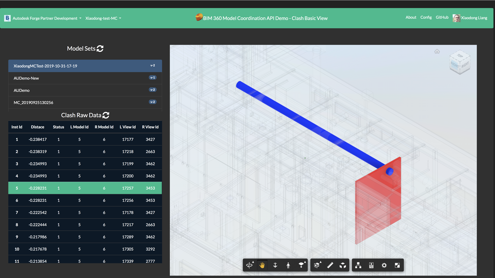
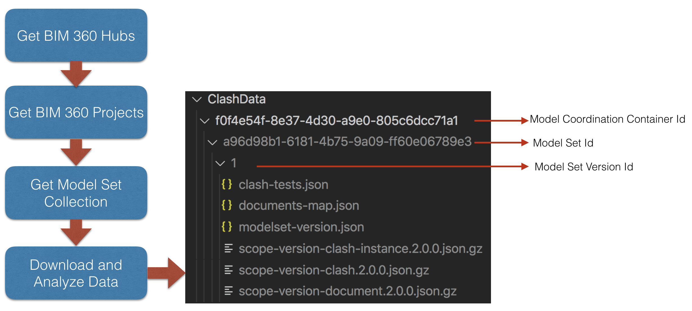
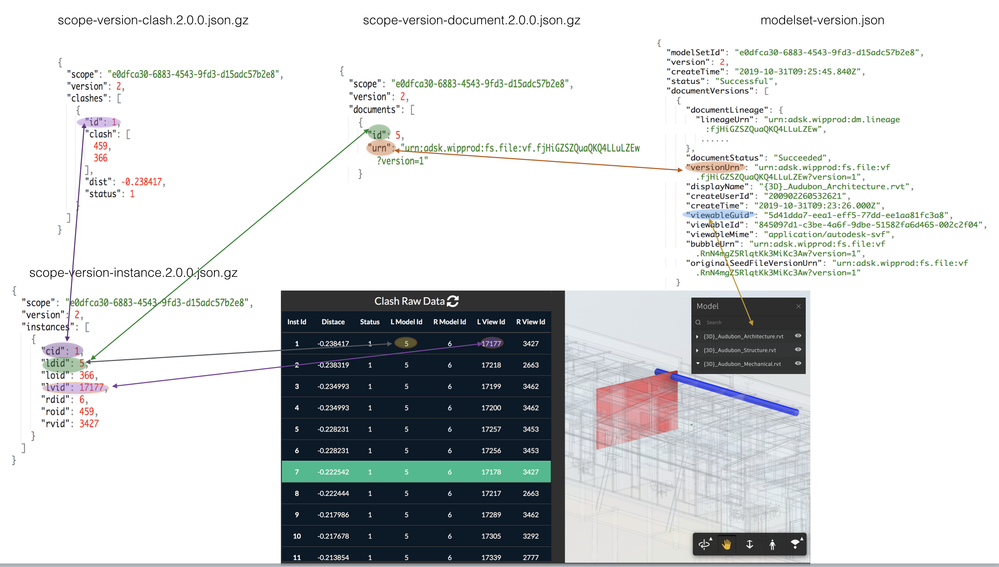
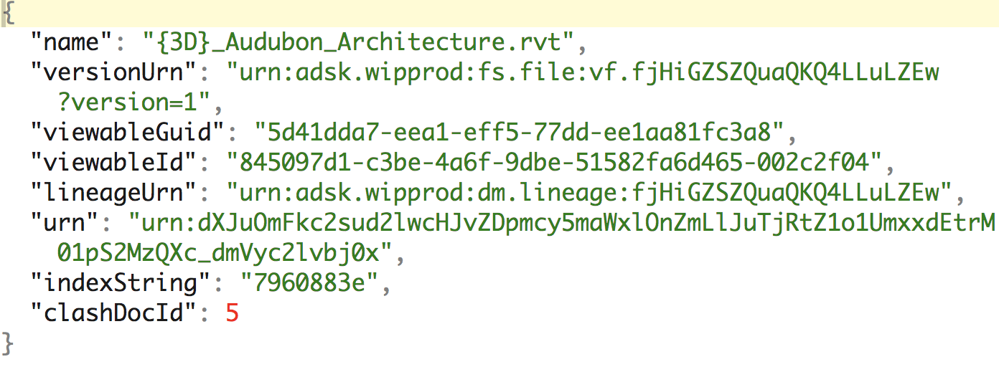
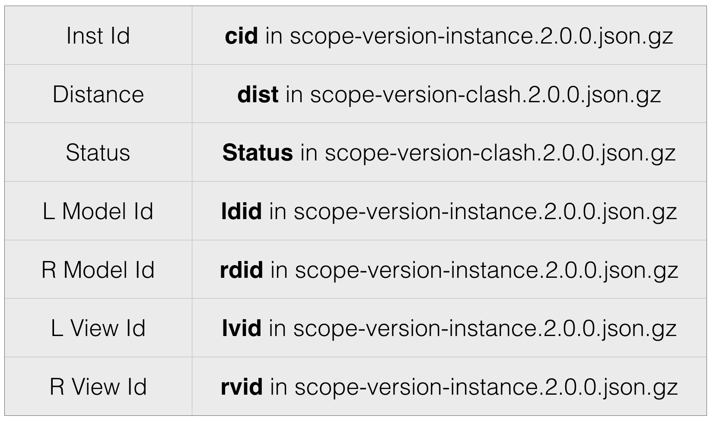

# BIM 360 Model Coordination API Sample - Clash View Basic Application

[](https://nodejs.org)
[](https://www.npmjs.com/)
[](https://code.visualstudio.com)

[](https://forge.autodesk.com/en/docs/oauth/v2/overview/)
[](https://forge.autodesk.com/en/docs/data/v2/developers_guide/overview/)
[](https://forge.autodesk.com/en/docs/viewer/v7/developers_guide/overview/)
[](https://forge.autodesk.com/en/docs/bim360/v1/overview/introduction/)

[](https://www.npmjs.com/package/forge-bim360-modelcoordination-modelset)
[](https://www.npmjs.com/package/forge-bim360-modelcoordination-clash)

[](http://opensource.org/licenses/MIT)
[](http://developer.autodesk.com/)


## Description
This repository demonstrates basic viewing of clash raw data by Model Coordination API. It lists all clash instances data, and allows the user to click one instance to highlight within Forge Viewer.

```diff
- Note: The logic of this sample works for ModelSet which are created after Oct 1st,2019
```

## Thumbnail

<p align="center"></p>

## Live version

https://bim360-clash-basic-view.herokuapp.com

note: provision the app key with test BIM account firstly. click **Config** to get detail information)

Watch [this video](https://youtu.be/flP7aEJpHAU) to learn how to use this demo.

## Demonstrations

1. After logging in, on top left of navigation panel, select one hub, then select one project.
2. After selecting one project, the active modelsets in this activeproject will be listed.
3. Click one modelset, all clash instances will be displayed. All documents of this modelset will also be loaded in Forge viewer
4. Select one clash, the corresponding clash will be highlighted in Forge viewer.


## Technology Architecture

The sample firstly downloads the model set data and clash data of the selected project.

<p align="center"></p>

The relationship of the data are demoed in the figure below:

<p align="center"></p>

Based on the relationship, the code analyzes the data to build the mapping among the clash document, version URN and viewable guid etc. The mapping is save to **docsMap.json**

<p align="center"></p>

The mapping of clash instances data and the clash table in the sample:
<p align="center"></p>


# Setup

## Prerequisites
1. To work with the sample, firstly upload some source models manually to a BIM 360 folder, or by other tools such as [BIM 360 Model Coordination Unit Test in Node.js](https://github.com/xiaodongliang/bim360-mcapi-node-unit.test/blob/master/test_04_CreateModelSet.js) and create a model set in Model Coordination module with this folder. The demo **source model files** can be found at [BIM 360 Model Coorination API Unit Test
in Node.js](https://github.com/xiaodongliang/bim360-mcapi-node-unit.test/tree/master/Source%20Files). It includes two versions of models set.
2. **BIM 360 Account**: must be an Account Admin to add the app custom integration, or be invited by an admin of a BIM 360 account. [Learn about provisioning](https://forge.autodesk.com/blog/bim-360-docs-provisioning-forge-apps).
3. **Forge Account**: Learn how to create a Forge Account, activate subscription and create an app at [this tutorial](http://learnforge.autodesk.io/#/account/). Get _Forge client id_, _Forge client secret_ and _Forge callback url_ and input them to [config.js](./server/config.js)
4. Create some [modelsets of Model Coordination](https://knowledge.autodesk.com/support/bim-360/learn-explore/caas/CloudHelp/cloudhelp/ENU/BIM360D-Model-Coordination/files/GUID-38CC3A1C-92FF-4682-847F-9CFAFCC4CCCE-html.html) in BIM 360.
5. **Node.js**: basic knowledge with [**Node.js**](https://nodejs.org/en/).
6. **JavaScript** basic knowledge with **jQuery** and **Bootstrap**

## Running locally
Clone this project or download it. It's recommended to install [GitHub desktop](https://desktop.github.com/). To clone it via command line, use the following (**Terminal** on MacOSX/Linux, **Git Shell** on Windows):

    git clone https://github.com/xiaodongliang/bim360-mcapi-node-clashview-basic.sample

Open the project folder in **Visual Studio Code**. Install the required packages, set the environment variables with your client ID & secret and finally start it. Via the command line, navigate to the folder where this repository was cloned and use the following:

```
npm install
node start.js
```
Open the browser: [http://localhost:3000](http://localhost:3000).

## Deployment

To deploy this application to Heroku, the **Callback URL** for Forge must use your `.herokuapp.com` address. After clicking on the button below, at the Heroku Create New App page, set your Client ID, Secret and Callback URL for Forge.

[](https://heroku.com/deploy?template=https://github.com/xiaodongliang/bim360-mcapi-node-clashview-basic.sample)

Watch [this video](https://www.youtube.com/watch?v=Oqa9O20Gj0c) on how deploy samples to Heroku.

## Further Reading
- [Model Coordination API](https://dev.forge.autodesk.com/en/docs/bim360/v1/tutorials/model-coordination/?sha=6092_51)
- [Model Coordination API SDK](https://www.npmjs.com/package/autodesk.forge.designautomation) 
- [BIM 360 API](https://forge.autodesk.com/en/docs/bim360/v1/overview/) and [App Provisioning](https://forge.autodesk.com/blog/bim-360-docs-provisioning-forge-apps)
- [Data Management API](https://forge.autodesk.com/en/docs/data/v2/overview/)
- [Viewer](https://forge.autodesk.com/en/docs/viewer/v7)
## Tutorials
- [Model Coordination API Document](https://dev.forge.autodesk.com/en/docs/bim360/v1/tutorials/model-coordination/mc-concept-modelset/?sha=6092_51)
- [View BIM 360 Models](http://learnforge.autodesk.io/#/tutorials/viewhubmodels)

## Blogs:

- [Forge Blog](https://forge.autodesk.com/categories/bim-360-api)
- [Field of View](https://fieldofviewblog.wordpress.com/), a BIM focused blog


## Tips & Tricks

- Since the clash data might be large, don't pull the file locally and then process it. Decompressing and streaming the results on the fly would also be recommended, as showned in this sample [utility.js](./server/utility.js)
- To make a simple demo, this sample does not use database to manage the clash data.
- On client (browser) side, it may be more effifient to manage the data by IndexDB if the app requires to perform various analysis in different browser sessions.


## Troubleshooting

- **Cannot see my BIM 360 projects**: Make sure to provision the Forge App Client ID within the BIM 360 Account, [learn more here](https://forge.autodesk.com/blog/bim-360-docs-provisioning-forge-apps). This requires the Account Admin permission.

- The code of highlighting objects within Forge Viewer requires the corresponding documents of one clash instance have been loaded. If not, the highlighting will not work, try again when the loading is completed
## License

This sample is licensed under the terms of the [MIT License](http://opensource.org/licenses/MIT). Please see the [LICENSE](LICENSE) file for full details.

## Written by

Xiaodong Liang [@coldwood](https://twitter.com/coldwood), [Forge Partner Development](http://forge.autodesk.com)
